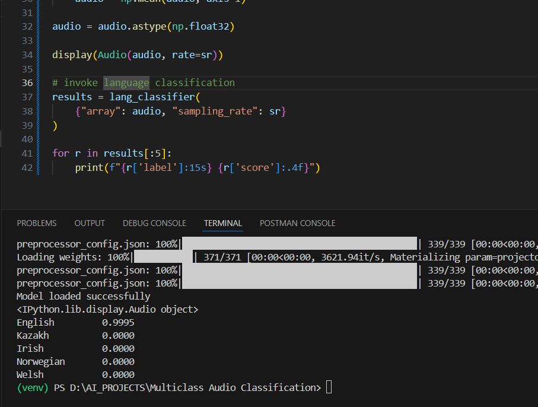

# Multiclass Audio Classification

A PyTorch-based audio classification system that uses Hugging Face's Wav2Vec2 model to classify audio files across multiple languages.
## Key Functions

### `load_audio(path)`

- Loads an audio file using librosa
- Resamples to 16kHz (required by Wav2Vec2)
- Returns audio array

### `classify_audio(audio_path)`

- Preprocesses audio with Wav2Vec2Processor
- Runs inference through the model
- Applies softmax for probability scores
- Returns dict with classification probabilities for each label

## 🧠 Model

* **Model type:** Multiclass audio classification
* **Framework:** PyTorch + Hugging Face Transformers
* **Task:** Language Identification
* **Model source:** Hugging Face Hub (configurable via environment variable)

---

## 🗂 Project Structure

```
src/
└── app/
    ├── main.py
    ├── config/
    │   └── settings.py
    ├── models/
    │   └── language_classifier.py
    ├── audio/
    │   └── audio_loader.py
    └── services/
        └── inference.py
```
## Supported Languages

The model classifies audio into 5 languages:

1. English
2. Welsh
3. Kabyle
4. Chinese_China
5. Russian

## Installation

```bash
pip install -r requirements.txt
```
## ▶️ Running the application

From the project root:

```bash
python -m app.py
```

This will:

1. Load the model
2. Load the audio input
3. Run language classification
4. Print top predictions with confidence scores

---

## Environment Variables

Create a `.env` file and set:

```
MODEL_NAME=<your_pretrained_model_name>
```

## Usage

```python
results = classify_audio("path_to_your_audio.wav")
print(results)
# Output: {"English": 0.95, "Welsh": 0.02, "Kabyle": 0.01, "Chinese_China": 0.01, "Russian": 0.01}
```
## 🖼 Sample Output (Visualization)

Below is an example output from **online audio classification** with ~95% confidence:

